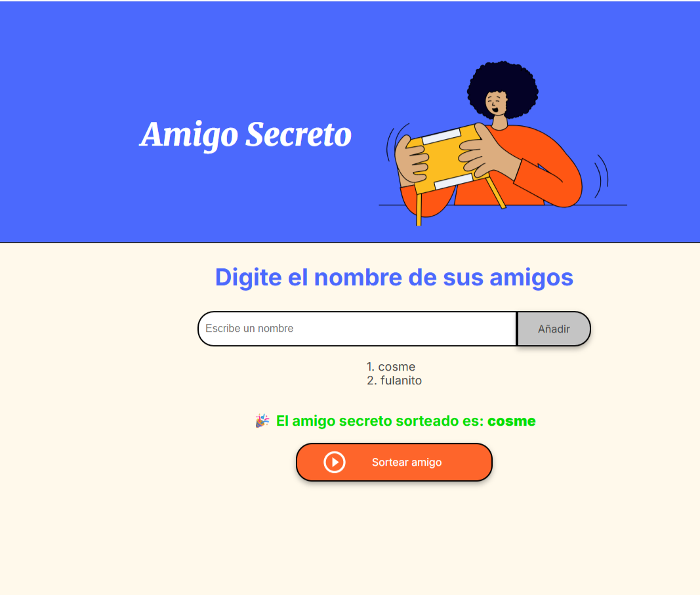

# 🎁 Amigo Secreto

Aplicación web para organizar un sorteo de Amigo Secreto.  
Permite ingresar participantes y sortear un nombre al azar.

## 🚀 Cómo usar
1. Abrí `index.html` en tu navegador.
2. Ingresá nombres en el campo de texto.
3. Presioná **Añadir** para agregarlos a la lista.
4. Hacé clic en **Sortear amigo** para ver el resultado.

## 📸 Captura

